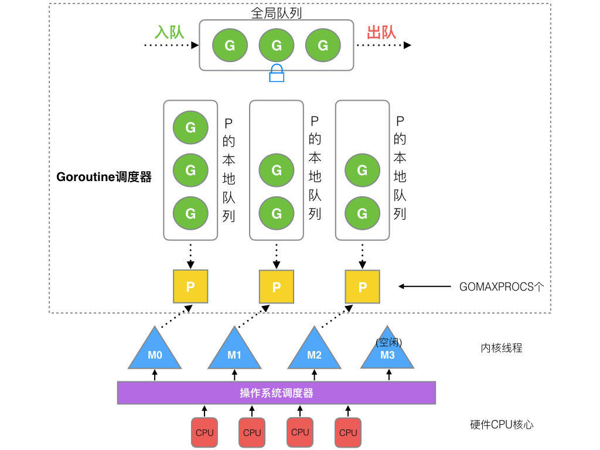

# Golang

### 关键字
#### new和make区别
    make关键字的作用是创建slice、map和channel等内置的数据结构， new的作用是为类型申请一片内存空间，并返回指向这片内存的指针。

#### defer顺序
    FILO后进先出

#### cap和len的区别
    cap表示最大容量，len表示当前长度。

### channel
#### 对空channel进行读写会发生什么
    阻塞当前goroutine。
#### 对已经关闭对channel进行读写会发生什么
    如果channel中还有未读取完的值，则读取剩下的值。否则返回默认零值。
#### 如何判断channel已经关闭
    通过返回的第二个字段(true or false)判断
#### 怎么循环读取channel的值
    通过for range语法读取
#### channel 有缓冲 与 无缓冲 的区别，主要用于什么场景
    提高并发
#### 如何判断chan是否满了
    select或者使用cap判断
#### 未初始化的channel
    读取未初始化的channel都会发生阻塞
#### 如何同时监听多个channel,或者说多路复用
    select监听多个channel

### map
#### 如何实现集合，value采用什么类型，为什么？
    可以使用布尔类型，不过会占用一定的内存空间。最好使用空结构体，因为空结构体不占用内存。
#### 如何实现顺序读实现
    使用切片获取key,排序后再进行读取。
#### 对一个map进行遍历，元素的顺序一样吗？
    不一样


### slice 
#### 怎么声明空数组，有什么区别
```go
package main
import "fmt"

func main()  {
   a := [...]int{}
   b := [0]int{}
   var c [0]int
   var d = [...]int{}
   fmt.Println(a == b, b == c, c == d) // true true true
}
```
#### 数组和切片的区别
    数组是值类型，切片是引用类型。切片可以动态伸缩。
#### 切片append会发生内存重新分配吗
    append后长度超过切片的cap会重新分配内存，分配大小为原来两倍的内存。
#### 截取切片的一部分赋给一个新的切片，修改这个新的切片其中的一个元素，那么原切片会被修改吗？对新的切片进行append操作，原切片会发生什么？
```go
// append不导致原切片cap发生改变，则会改变原切片值
package main

import "fmt"

func main()  {
   a := make([]int, 10)
   for i := 0; i < 5; i++ {
      a[i] = i+1
   }
   b := a[2:4]
   b[0] = 10
   fmt.Println(cap(b))
   b = append(b, 9,29)
   fmt.Println(a) // [1 2 10 4 9 29 0 0 0 0]
   fmt.Println(b) // [10 4 9 29]
}
// append 导致原切cap发生改变，新切片指向新数组
//a := make([]int, 5)
//for i := 0; i < 5; i++ {
//a[i] = i+1
//}
//b := a[2:4]
//b[0] = 10
//fmt.Println(cap(b))
//b = append(b, 9,29)
//fmt.Println(a) // [1 2 10 4 5]
//fmt.Println(b) // [10 4 9 29]
```

### string
#### 单引号、双引号、反引号有什么区别
    单引号表示byte或者rune类型， 双引号表示字符串类型支持转义序列， 反引号表示字符串字面量，不支持转义序列。
#### string 和 []byte 进行转换时会发生内存拷贝吗？
    不会， string类型底层包含[]byte类型。
#### 字符串拼接相关，内存拷贝问题，如何高效拼接字符串

### struct
#### 空结构体
    空结构体不占用内存，一般可以用来实现集合、控制协程并发和仅包含方法的结构体。
#### 结构体方法采用指针和非指针区别
    golang参数传递都是值传递方式, 要改变结构体内部的值需要传指针。对于接口来说，*T包含的方法集合包括接收者是*T和T的方法，而T包含的方法集合只包含接收者是T的方法

### 协程
#### GMP模型以及数量关系
1. GMP模型

    - G: goroutine协程
    - P: processor处理器(包含了G)
    - M: 系统级线程, M关联一个KSE实体(即操作系统内核可调度的最小单位)
2. 调度器策略

    - 复用线程: 避免频繁创建、销毁线程。
    - work stealing机制  
         当本线程无可运行的 G 时，尝试从其他线程绑定的 P 偷取 G，而不是销毁线程。
    - hand off机制  
         当本线程因为 G 进行系统调用阻塞时，线程释放绑定的 P，把 P 转移给其他空闲的线程执行。
#### 一个协程只会在一个processor上运行吗
      不会
#### 如何准确等待所有协程的结束
```go
package main

import (
	"fmt"
	"sync"
)

func main() {
	var wg sync.WaitGroup
	for i := 0; i < 10; i++ {
		wg.Add(1)
		go func(a int) {
			defer wg.Done()
			fmt.Println(a)
		}(i)
	}
	wg.Wait()
}
```

#### 如何等待任意一个任务返回
[等待任意一个任务返回源码](./fcfs/fcfs.go)
#### 生产者消费者模型
```go

package main

import (
	"fmt"
	"os"
	"os/signal"
	"syscall"
)

func Producer(factor int, out chan <- int) {
	for i := 0; ; i++ {
		out <- factor * i
	}
}
func Consumer(in <-chan int) {
	for v := range in {
		fmt.Println(v)
	}
}

func main() {
	// 简单的生产者/消费者模型
	// 成果队列
	ch := make(chan int, 10)

	// 两个生产者
	go Producer(3, ch)
	go Producer(5, ch)

	// 一个消费者
	go Consumer(ch)

	// ctrl + c退出
	sig := make(chan os.Signal, 1)
	signal.Notify(sig, syscall.SIGINT, syscall.SIGTERM)
	fmt.Printf("quit by (%v)\n", <-sig)
}
```
#### 如何控制多个协程(任务)同时结束
#### 单例模式
```go
package main

import (
	"fmt"
	"sync"
)

func main() {
	// 单例模式
	var once sync.Once

	onceBody := func() {
		fmt.Println("Only once")
	}

	done := make(chan struct{}, 10)

	for i := 0; i < cap(done); i++ {
		once.Do(onceBody)
		done <- struct{}{}
	}

	for i := 0; i < cap(done); i++ {

	}
}
```
### 发布订阅模型
[发布者订阅者模型代码](./pubsub/pubsub.go)
```go
package main

import (
	"fmt"
	"interview/pubsub"
	"os"
	"os/signal"
	"syscall"
	"time"
)

func main() {
	p := pubsub.NewPublisher(10, 100*time.Millisecond)
	defer p.Close()
	all := p.Subscribe()
	filtrate := p.SubscribeTopic(func(v interface{}) bool {
		if num, ok := v.(int); ok {
			return num > 10
		}
		return false
	})
	go p.Publish(12)
	go p.Publish(4)

	go func() {
		for v := range all {
			fmt.Printf("all: %v\n", v)
		}
	}()

	go func() {
		for v := range filtrate {
			fmt.Printf("more than 10 : %v\n", v)
		}
	}()

	sig := make(chan os.Signal, 1)
	signal.Notify(sig, syscall.SIGINT, syscall.SIGTERM)

	fmt.Println("quit", <-sig)
}
```
### GC
    - 标记-清除法  
        措施：stw - 标记 - 清除 - stw
        缺点：gc期间暂停业务运行，可能会出现业务卡顿现象
    - 三色标记法 + 堆插入屏障（满足强三色不变式） + 堆删除屏障（满足弱三色不变式）
        不使用STW，此时如果出现黑色对象引用白色对象， 而白色对象的上游灰色对象被删除；会出现对象被误删除。  
        解决方式：满足强/弱三色不变式之一， 堆上添加对象时，使用插入屏障（添加对象标记为灰色， 也就不会出现黑色对象引用白色对象的情况）， 堆上删除对象时，使用删除屏障（如果被删除对象时白色或者灰色， 标记该对象为灰色）；  
        缺点是：由于栈上没有使用添加/删除屏障， 灰色标记队列为空时， 回收对象之前， 使用rescan栈上的对象， 然后在进行回收；另外删除屏障会导致回收精度低， 会出现延迟回收；
    - 三色标记法 + 混合写屏障机制（满足变形的弱三色不变式）  
      具体操作：
        - GC开始时将栈上的对象全部扫描并标记为黑色（栈无需二次扫描）
        - GC期间， 任何在栈上创建的新对象都标记为黑色
        - 被删除的对象标记为灰色
        - 被添加的对象标记为灰色  
      优点：栈上无需二次扫描， 对象的回收是延迟回收。
### 逃逸分析
    编译期做逃逸分析，首先可以减少垃圾回收的压力，变量如果没有逃逸到heap上，内存分配相对更加容易，函数运行结束的同时直接回收变量资源，  
    其次逃逸分析过后可以知道那些变量可以分配在栈上，栈上分配更快，性能更好，  
    再者可以做同步消除，定义变量的函数如果有同步锁，而运行时只有一个线程访问，逃逸分析后的机器码，会去掉同步锁。
### HTTPS原理分析
[https原理分析](https://juejin.cn/post/6844903830916694030)