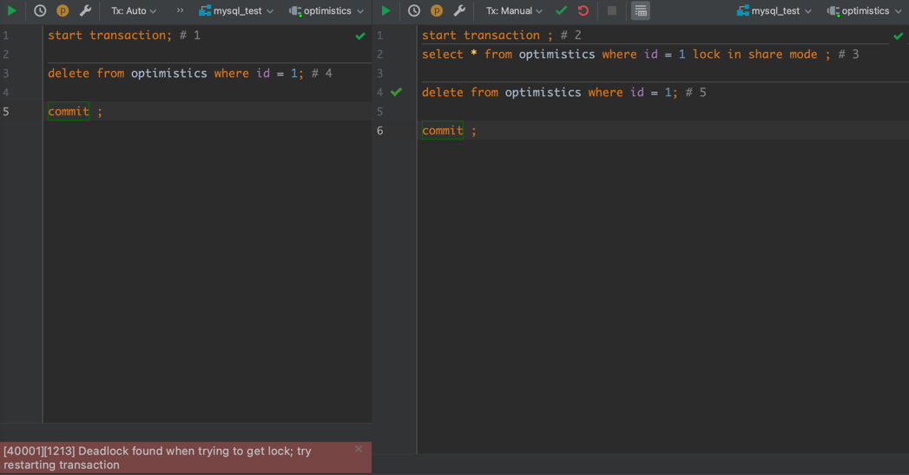

# mysql
#### 事务的四大特性ACID
- 原子性（atomicity）: 一个事务所有操作要么全部提交成功，要么全部失败回滚，这就是事务的原子性。  
- 一致性（consistency）: 数据总是从一个一致性的状态转移到另一个一致性的状态。
- 隔离性（isolation）: 一个事务所做的修改在最终提交前，对其他事务是不可见的，多个并发事务是相互隔离的 。关于事务的隔离性，mysql提供了四种隔离级别。
- 持久性（durability）: 一旦事务提交，所做的修改会永久保存到数据库中。即便系统崩溃，修改的数据也不会丢失。
#### 事务的隔离级别
- Read-uncommitted（可读未提交）：安全最低级别，任何情况都无法保证。
  - 实现原理：事务在读取操作时不添加共享锁，事务更新操作只添加行级共享锁，数据更新完即释放行级共享锁。
    ```mysql
    / Query 1 / SELECT age FROM users WHERE id = 1; / will read 20 /
    / Query 2 / UPDATE users SET age = 21 WHERE id = 1; / No commit here /
    / Query 1 / SELECT age FROM users WHERE id = 1; / will read 21 /
    ROLLBACK; / lock-based DIRTY READ /
    / 事务1读取到事务2尚未提交的数据 /
    ```
- Read-committed（可读已提交）：可避免脏读的情况。
  - 实现原理：事务对当前读取的数据添加行级共享锁，一旦读取完立即释放该行级共享锁。事务对当前更新的数据添加行级排他锁直至事务结束。
    ```mysql
    / Query 1 / SELECT * FROM users WHERE id = 1;
    / Query 2 / UPDATE users SET age = 21 WHERE id = 1; COMMIT; / in multiversion concurrency control, or lock-based READ COMMITTED /
    / Query 1 / SELECT FROM users WHERE id = 1; COMMIT; /lock-based REPEATABLE READ */
    / 事务1读取到了事务2提交的数据，避免了脏读， 但是不能解决重复读的问题。/
    ```
- Repeated-read（可重复读）：可避免重复读，脏读的情况。
  - 实现原理：事务在读取某数据的瞬间，必须对其添加行级共享锁直到事务结束才释放（行级共享锁这代表着该事务过程中，只允许其他事务读取该行数据，不允许
    其他事务更新该行级数据）。事务在更新某数据的瞬间，必须对其添加行级排他锁直到事务结束才释放（行级排他锁意味着在该事务过程中，其他事务既不能读取
    也不能修改）。
    ```mysql
    / Query 1 / SELECT * FROM users WHERE id = 1; COMMIT;
    / Query 2 / UPDATE users SET age = 21 WHERE id = 1; COMMIT; / in multiversion concurrency control, or lock-based READ COMMITTED /
    / 解决了脏读， 重复读的问题 /
    ```
- Serializable（串行化）：安全级别最高，可避免幻读，重复读，脏读的情况。
  - 实现原理：事务在读取数据的时，必须对其添加表级共享锁直到事务结束才释放。事务在更新数据时，必须对其添加表级排他锁直到事务结束才释放。
    ```mysql
    / Query 1 / SELECT * FROM users WHERE age BETWEEN 10 AND 30;
    / Query 2 / INSERT INTO users VALUES ( 3, 'Bob', 27 ); COMMIT;
    / Query 1 / SELECT * FROM users WHERE age BETWEEN 10 AND 30;
    / 如果事务1和事务2都是行级锁，那么在事务1执行的过程中，事务2是可以插入新数据的（新数据并没有行级锁的束缚）。但是事务1和2加的是表级锁，那么事
    务1执行过程中，事务2就无法加表级排他锁。这就解决了幻读问题。/
    ```
#### 脏读 && 幻读 && 不可重复读
- 脏读：一个事务在处理过程中读取了另一个未提交事务中的数据。
- 幻读：幻读是事务非独立执行时发生的一种现象，例如，事务T1对一个表中所有行的某个字段做了"1"到"2"的修改的操作，这是事务T2又插入了一条新的记录，而
该字段的值为"1"并且提交给数据库。这时如果事务T1再次查看刚刚修改的数据，会发现还有一行没有修改，这其实是在事务T2添加的，就好像产生了幻觉，这就是幻读。
- 不可重复读：对于数据库中的某个数据，一个事务过程多次读取到不同的结果。这是由于事务在执行过程中，数据被另一个事务修改并且提交了。
 - 幻读跟不可重复读的区别：事务执行过程添加表级/行级锁，锁的颗粒不同。
#### 死锁，悲观锁和乐观锁
- 乐观锁：用数据版本（Version）记录机制实现，这是乐观锁最常用的一种方式。何谓数据版本？一般是通过为数据表增加一个数字类型的字段version来实现。
读取数据时将version取出，更新数据时将version+1。向数据库提交更新数据时，判断数据库记录version值与之前取出的version值是否一致，如一致则更新， 
  否则失败。
  [乐观锁源代码golang版本](./optimistic/optmistic.go)  
- 悲观锁:常见的数据库自带的锁都属于悲观锁，例如行级锁、表级锁、共享锁、排他锁等等。默认引擎是innodb
  - 共享锁：允许一个事务去读一行，阻止其他事务获得相同数据集的排他锁（lock in share mode）。
  - 排他锁：允许获得排他锁的事务更新数据集，阻止其他事务获取相同数据集的共享锁和排他锁（for update）。
- 死锁：死锁是不同事务无法继续进行的情况，因为每个事务都持有另一个需要的锁。因为两个事务都在等待资源变得可用，所以它们都不会释放它持有的锁。

#### 内链接和外链接的区别
- 内连接（inner join）：取出两张表中匹配到的数据，匹配不到的不保留
- 外连接（outer join）：取出连接表中匹配到的数据，匹配不到的也会保留，其值为NULL
#### varchar与char的区别
- char: 固定长度字符类型，读取时会截取尾部多余的空格。
- varchar: 可变长度字符类型。
#### UNION与UNION ALL的区别
    union会去重，而union all返回所有组合结果。
#### 如何定位及优化SQL语句的性能问题？

#### 大表数据查询，怎么优化

#### 主键使用自增ID还是UUID

#### 字段为什么要求定义为not null

#### sql优化

#### 非聚集索引一定会回表查询？
    不一定，这涉及到查询语句所要求的字段是否全部命中了索引，如果全部命中了索引，那么就不必再进行回表查询。
`select age from users where age > 1 and age < 20;`非聚簇索引叶子节点信息已经包含了age信息，不需要再次会表查询。
#### b+tree
    一个B+树有以下特征：
    1. 有n个子树的中间节点包含n个元素，每个元素不保存数据，只用来索引，所有数据都保存在叶子节点。
    2. 所有叶子节点包含元素的信息以及指向记录的指针，且叶子节点按关键字自小到大顺序链接。
    3. 所有的中间节点元素都同时存在于子节点，在子节点元素中是最大（或最小）元素。
#### 索引的优缺点
##### 优点
- 提高数据检索效率，降低数据库的IO成本。
- 通过索引对数据进行排序，降低数据排序的成本降低了CPU的消耗。
- 加快数据查询速度。
##### 缺点
- 创建索引和维护索引要耗费时间，并且随着数据量的增加所耗费的时间也会增加。
- 索引也需要占空间，我们知道数据表中的数据也会有最大上线设置的，如果我们有大量的索引，索引文件可能会比数据文件更快达到上线值。
#### 创建索引会考虑什么因素

#### 实操
##### 我们将用户表按用户id取模散列到了10张表（t_user_00至t_user_09）,现在用户激增，需要将10张表扩张到100张(t_user_00至t_user_99),请问在不停服情况下，用什么方法实现扩容。数据迁移过程中，用户可能进行修改数据。

##### 建立评论区， 评论区分为两层， 用户可以直接评论（一级评论），也可以评论某一级评论（产生二级评论），还可以在二级评论中相互回复，设计一张评论表。
    在以评论为主的树形显示情况下，可以使用单表，添加一个parent_id字段来指向父评论。
| 字段 |
| --- |
| id |
|type_id|
|type_title|
|content|
|to_id|
|from_id|
|parent_id|